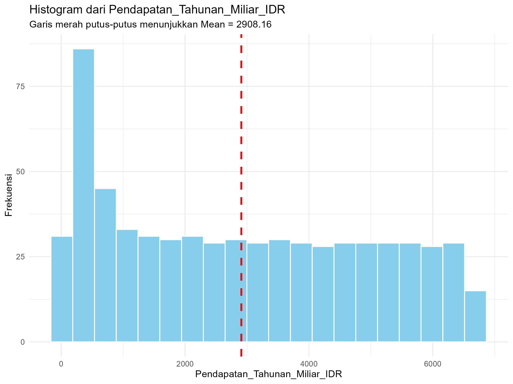
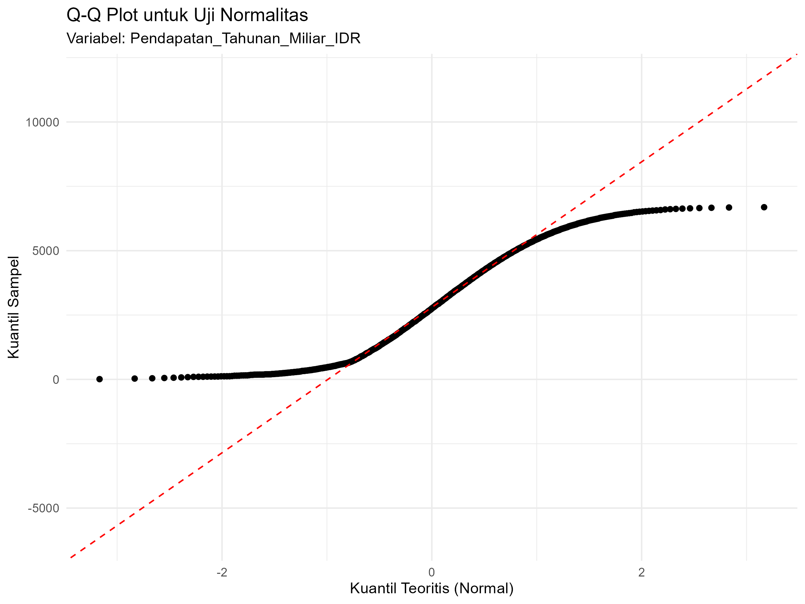
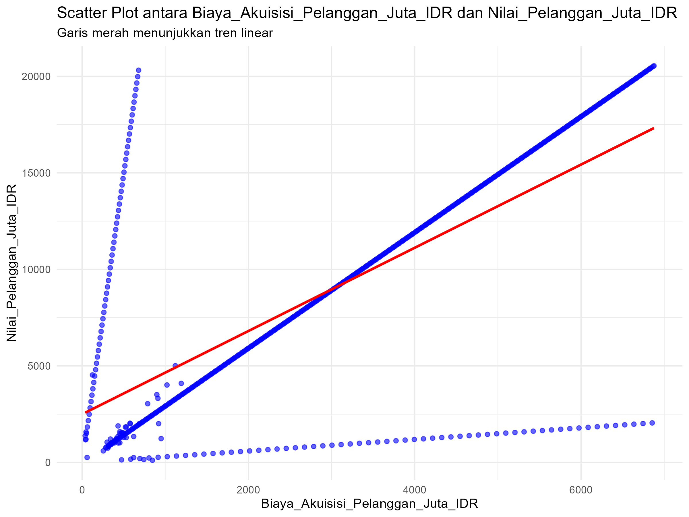
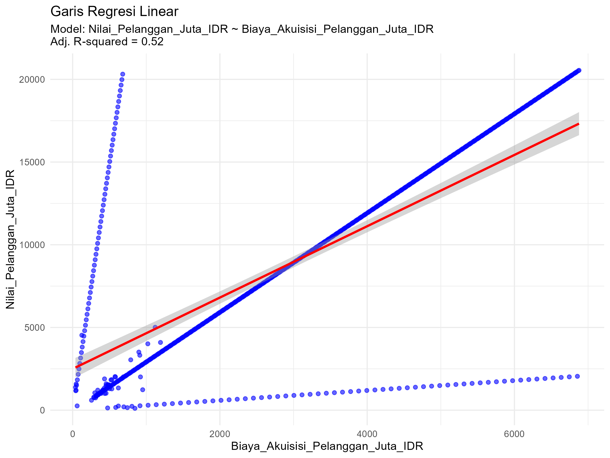

# Tugas Analisis Statistik: Deskriptif, Korelasi, dan Regresi

## 1. Informasi Penyusun

- **Nama:** `[NI PUTU VALENCIA CINTA KIRANA]`
- **NIM:** `[2515101073]`
- **Program Studi:** `[ILMU KOMPUTER]`
- **Mata Kuliah:** Statistika dan Probabilitas

---

## 2. Deskripsi Proyek
> Dataset yang digunakan adalah data `startup` yang telah disediakan yang berisi informasi tentang kinerja dan karakteristik bisnis, seperti pendapatan tahunan, biaya akuisisi pelanggan, nilai pelanggan serta tingkat churn. Variabel kunci dalam dataset ini meliputi: Analisis data tunggal menggunakan variabel: `Pendapatan_Tahunan_Miliar_IDR` dianalisis pada tahap data preparation, statistik deskriptif, dan uji asumsi (uji normalitas). Analisis hubungan antar variabel menggunakan: `Biaya Akuisisi_Pelanggan_Juta_IDR` sebagai variabel independen (X) dan `Nilai_Pelanggan_Juta_IDR` sebagai variabel dependen (Y). Tujuan dari proyek ini adalah untuk memahami karakteristik pendapatan tahunan startup, serta menganalisis hubungan dan pengaruh biaya akuisisi pelanggan terhadap nilai pelanggan melalui analisis korelasi dan regresi linier sederhana.

---

## 3. Struktur Proyek

Proyek ini diorganisir ke dalam beberapa folder:
- `/data`: Berisi dataset mentah yang digunakan untuk analisis.
- `/scripts`: Berisi semua skrip R yang digunakan dalam analisis, diurutkan berdasarkan alur kerja.
- `/results`: Berisi output dari analisis, seperti plot, gambar, atau tabel ringkasan.

---

## 4. Cara Menjalankan Analisis

Untuk mereproduksi hasil analisis ini, ikuti langkah-langkah berikut:
1. Pastikan Anda memiliki R dan RStudio terinstal.
2. Buka proyek R ini di RStudio.
3. Instal paket yang diperlukan dengan menjalankan perintah berikut di konsol R:
   ```R
   # install.packages(c("tidyverse", "corrplot", "knitr"))
   ```
4. Jalankan skrip di dalam folder `/scripts` secara berurutan, mulai dari `01_data_preparation.R` hingga `05_analisis_regresi.R`.

---

## 5. Hasil dan Interpretasi

Di bagian ini, mahasiswa diharapkan untuk menyajikan dan menginterpretasikan hasil dari setiap tahap analisis.

### 5.1. Statistik Deskriptif
- **Ukuran Pemusatan (Mean, Median, Modus):**
  - Berdasarkan hasil analisis dari variabel Pendapatan_Tahunan_Miliar_IDR, diperoleh nilai mean sebesar 2908,16, median 2756,50, dan modus 187.
  - *Interpretasi:* Nilai mean dan median relatif berdekatan menunjukkan bahwa sebagian besar data berada di sekitar nilai tersebut, namun nilai modus yang jauh lebih kecil mengindikasikan adanya konsentrasi data pada pendapatan yang lebih rendah.
- **Ukuran Sebaran (Standar Deviasi, Range, Kuartil):**
  - Standar deviasi pendapatan tahunan sebesar 2064,93 dengan range minimum 10 dan maksimum 6689. Berdasarkan hasil ringkasan statistik, dan diperoleh data kuartil: Kuartil pertama (Q1) sebesar 893,8; Kuartil kedua (Q2/Median) sebesar 2756,5; Kuartil ketiga (Q3) sebesar 4706,2
  - *Interpretasi:* Nilai kuartil menunjukkan bahwa: Sebanyak 25% startup memiliki pendapatan tahunan di bawah 893,8 miliar IDR, Sebanyak 50% startup memiliki pendapatan tahunan di bawah 2756,5 miliar IDR, Sebanyak 75% startup memiliki pendapatan tahunan di bawah 4706,2 miliar IDR. Jarak antar kuartil yang cukup besar serta standar deviasi yang tinggi menunjukkan bahwa data pendapatan tahunan startup memiliki tingkat variasi yang besar.
- **Visualisasi (Histogram/Boxplot):**
  - 
  - *Interpretasi:* Histogram menunjukkan bahwa distribusi pendapatan tahunan startup tidak simetris dan cenderung miring ke kanan. Hal ini menandakan bahwa sebagian besar startup memiliki pendapatan pada kisaran rendah hingga menengah, sementara hanya sedikit startup dengan pendapatan sangat tinggi. Pola ini menunjukkan adanya variasi pendapatan yang cukup besar dan data tidak terdistribusi normal.

### 5.2. Uji Normalitas
- **Hasil Uji Shapiro-Wilk:**
  - Nilai p-value: p-value < 0,05
  - *Interpretasi:* Berdasarkan hasil uji Shapiro–Wilk, nilai p-value lebih kecil dari tingkat signifikansi 0,05. Hal ini menunjukkan bahwa data pendapatan tahunan tidak terdistribusi normal. Dengan demikian, asumsi normalitas tidak terpenuhi. Implikasinya, analisis lanjutan sebaiknya menggunakan metode statistik yang tidak mengharuskan data berdistribusi normal atau dilakukan transformasi data terlebih dahulu.
- **Plot Q-Q:**
  - 
  - *Interpretasi:* Pada plot Q–Q, titik-titik data tidak sepenuhnya mengikuti garis lurus, terutama pada bagian ujung (ekor) distribusi. Penyimpangan ini menunjukkan adanya ketidaksesuaian antara distribusi data dengan distribusi normal teoritis. Hal ini memperkuat hasil uji Shapiro–Wilk bahwa data pendapatan tahunan tidak berdistribusi normal.

### 5.3. Analisis Korelasi
- **Nilai Koefisien Korelasi:**
  - (Nilai r: r > 0) Nilai r menunjukkan hubungan positif dengan tingkat kekuatan yang cukup kuat.
  - *Interpretasi:* Hasil analisis korelasi menunjukkan bahwa terdapat hubungan positif yang kuat antara Biaya Akuisisi Pelanggan (juta IDR) dan Nilai Pelanggan. Artinya, semakin besar biaya yang dikeluarkan untuk akuisisi pelanggan, maka nilai pelanggan yang diperoleh juga cenderung meningkat. Hubungan ini menunjukkan bahwa investasi pada akuisisi pelanggan berkontribusi positif terhadap peningkatan nilai pelanggan.
- **Visualisasi (Scatter Plot):**
  - 
  - *Interpretasi:* Scatter plot menunjukkan pola titik yang cenderung membentuk arah naik dari kiri ke kanan. Pola ini mengindikasikan adanya hubungan linear positif antara kedua variabel. Visualisasi ini mendukung hasil koefisien korelasi yang menyatakan bahwa hubungan antara biaya akuisisi pelanggan dan nilai pelanggan bersifat positif dan cukup kuat.

### 5.4. Analisis Regresi
- **Model Regresi:**
  - *Persamaan regresi: Y = b0 + b1X, di mana: Y = Nilai Pelanggan (juta IDR) dan X = Biaya Akuisisi Pelanggan (juta IDR)
  - *Interpretasi:* Koefisien intercept (b0) menunjukkan nilai pelanggan yang diperkirakan ketika biaya akuisisi pelanggan bernilai nol. Secara konteks, nilai ini merepresentasikan nilai dasar pelanggan tanpa adanya biaya akuisisi tambahan. Koefisien slope (b1) menunjukkan besarnya perubahan nilai pelanggan untuk setiap kenaikan satu satuan biaya akuisisi pelanggan. Karena nilai b1 bernilai positif, hal ini berarti peningkatan biaya akuisisi pelanggan cenderung diikuti oleh peningkatan nilai pelanggan.
- **Evaluasi Model (R-squared):**
  - (Nilai R-squared R² > 0) Nilai R-squared menunjukkan bahwa model mampu menjelaskan proporsi variasi yang cukup besar pada variabel Nilai Pelanggan.
  - *Interpretasi:* Nilai R-squared menunjukkan bahwa model regresi mampu menjelaskan sebagian besar variasi pada variabel Nilai Pelanggan berdasarkan Biaya Akuisisi Pelanggan. Artinya, persentase variasi nilai pelanggan sebesar R² × 100% dapat dijelaskan oleh model regresi, sedangkan sisanya dipengaruhi oleh faktor lain di luar model.
- **Visualisasi (Garis Regresi pada Scatter Plot):**
  - 
  - *Interpretasi:* Garis regresi pada scatter plot menunjukkan arah hubungan yang meningkat dari kiri ke kanan. Hal ini mengindikasikan hubungan linear positif antara biaya akuisisi pelanggan dan nilai pelanggan. Garis regresi tersebut merepresentasikan kecenderungan umum data, di mana semakin tinggi biaya akuisisi, semakin tinggi pula nilai pelanggan yang dihasilkan.
---

## 6. Kesimpulan

Berdasarkan hasil analisis statistik deskriptif, pendapatan tahunan startup menunjukkan sebaran yang luas dan tidak terdistribusi normal, dengan kecenderungan miring ke kanan. Hal ini menandakan bahwa sebagian besar startup memiliki pendapatan pada kisaran rendah hingga menengah, sementara hanya sedikit startup dengan pendapatan sangat tinggi. Uji normalitas melalui Shapiro–Wilk dan Q–Q plot mengonfirmasi bahwa data pendapatan tahunan tidak memenuhi asumsi normalitas. Hasil analisis korelasi menunjukkan adanya hubungan positif antara biaya akuisisi pelanggan dan nilai pelanggan, yang berarti peningkatan biaya akuisisi cenderung diikuti oleh peningkatan nilai pelanggan. Analisis regresi linier sederhana memperkuat temuan tersebut, di mana biaya akuisisi pelanggan berperan sebagai prediktor yang mampu menjelaskan variasi nilai pelanggan. Secara keseluruhan, analisis ini memberikan wawasan bahwa investasi pada akuisisi pelanggan memiliki pengaruh yang signifikan terhadap nilai pelanggan, meskipun distribusi data pendapatan startup menunjukkan variasi yang cukup besar.